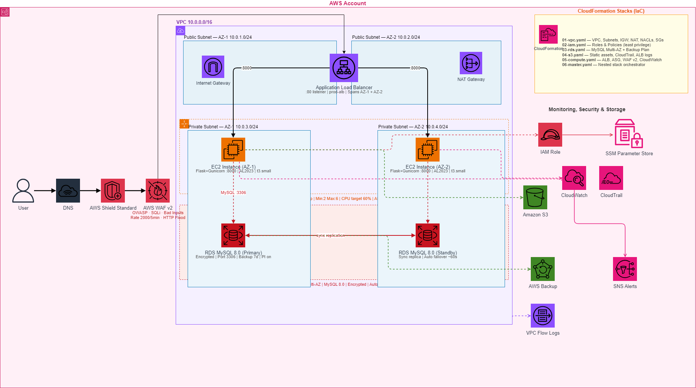
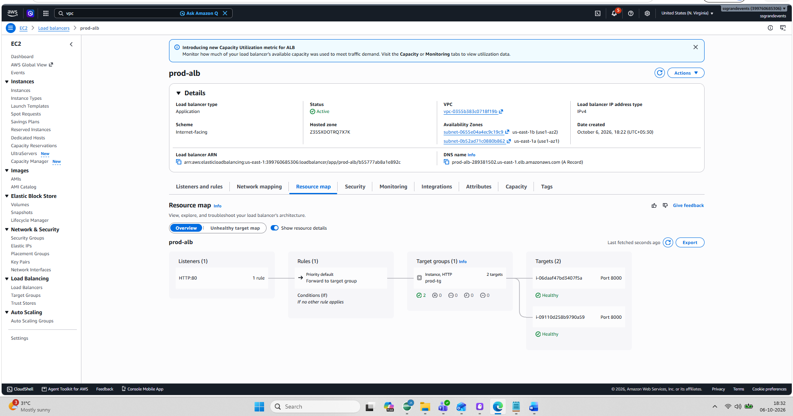
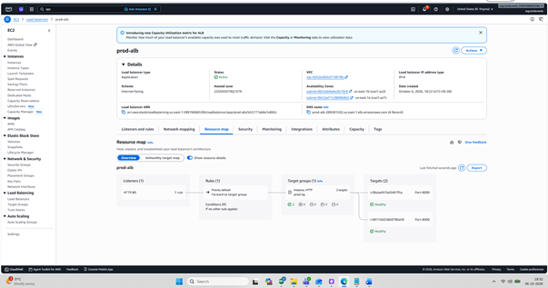
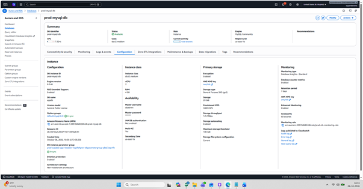
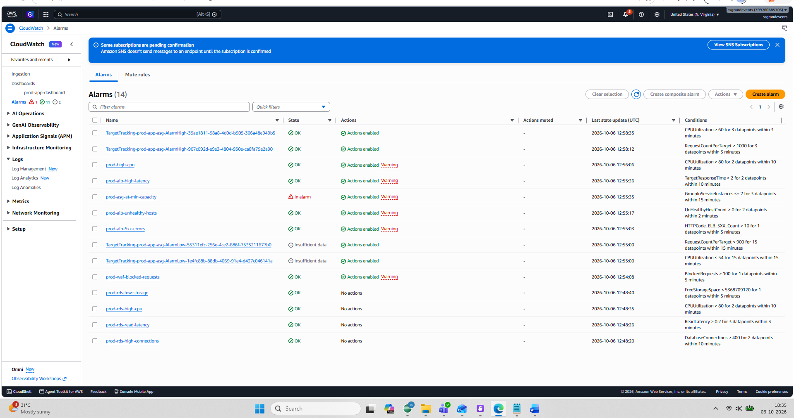
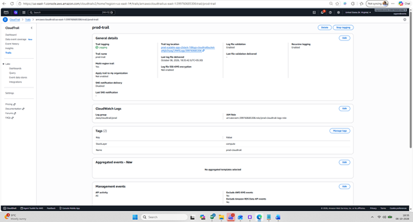
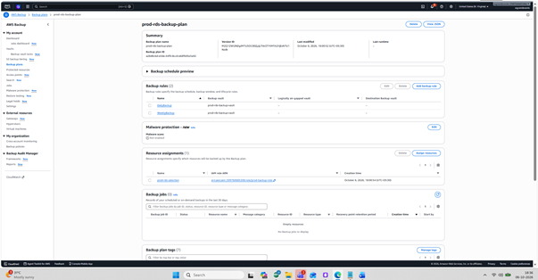

# AWS Technical Challenge — Scalable Web Application on AWS

**Candidate:** Jayaprakash Mariyappa &nbsp;|&nbsp; **Date:** October 2026 &nbsp;|&nbsp; **Account:** 399760685306 &nbsp;|&nbsp; **Region:** us-east-1

---

## Challenge Summary

> Design, implement, and deploy a scalable web application on AWS with a front-end, back-end, and data storage solution — focusing on scalability, security, and high availability.

| # | Requirement | Implementation |
|---|-------------|----------------|
| 1 | Infrastructure as Code | AWS CloudFormation — 6 nested templates, single deploy command |
| 2 | Compute + Auto Scaling | EC2 ASG (min 2, max 6) with CPU and request-based target tracking |
| 3 | VPC — public + private subnets | 10.0.0.0/16, 2 public + 2 private subnets across 2 AZs, IGW + NAT GW, NACLs, SGs |
| 4 | Load Balancing | Application Load Balancer — internet-facing, multi-AZ, health checks on `/health` |
| 5 | Storage | S3 (static assets, encrypted, versioned) + RDS MySQL 8.0.46 Multi-AZ |
| 6 | Security | WAF v2 (7 rules: OWASP, SQLi, DDoS, rate limit, IP reputation) + Shield Standard + IAM least privilege |
| 7 | Monitoring & Logging | CloudWatch dashboard + 8 alarms + SNS + CloudTrail (multi-region) + VPC Flow Logs |
| 8 | Backup & Recovery | AWS Backup daily (30-day) + weekly (90-day) + RDS automated 7-day backups |

**Application:** Python Flask REST API served by Gunicorn, DB credentials fetched from SSM Parameter Store at boot — no secrets in code.

---

## Architecture



---

## Solution Summary

| Layer | Service | Detail |
|-------|---------|--------|
| IaC | CloudFormation | 6 nested templates, single deploy command |
| Compute | EC2 + Auto Scaling | t3.small, min 2 / max 6, Amazon Linux 2023 |
| Load Balancer | Application Load Balancer | Internet-facing, multi-AZ, health checks |
| Database | RDS MySQL 8.0.46 | Multi-AZ, encrypted, deletion protection |
| Storage | S3 | Static assets, audit logs, ALB logs |
| Security | WAF v2 + Shield Standard | 7 WAF rules incl. Layer 7 DDoS protection |
| Monitoring | CloudWatch | Dashboard, 8 alarms, 4 log groups |
| Audit | CloudTrail | Multi-region, log file validation |
| Backup | AWS Backup | Daily (30-day) + weekly (90-day) plans |

---

## Repository Structure

```
├── cloudformation/
│   ├── 01-vpc.yaml         # VPC, subnets, IGW, NAT GW, NACLs, SGs, Flow Logs
│   ├── 02-iam.yaml         # IAM roles — EC2, RDS, Backup, CloudTrail
│   ├── 03-rds.yaml         # RDS MySQL Multi-AZ, alarms, SSM params
│   ├── 04-s3.yaml          # S3 buckets (static, audit, ALB logs)
│   ├── 05-compute.yaml     # ALB, ASG, WAF, CloudTrail, CW Dashboard
│   └── 06-master.yaml      # Master stack — orchestrates all nested stacks
├── app/
│   ├── app.py              # Flask REST API
│   └── requirements.txt
├── scripts/
│   └── deploy.sh           # One-command deployment
├── screenshots/            # AWS Console evidence
└── README.md
```

---

## Deployment

```bash
bash scripts/deploy.sh prod
```

Deploys all stacks in order: VPC → IAM → S3 → RDS (~15 min Multi-AZ) → Compute

---

## Evidence

### 1. Load Balancing — Application Load Balancer

`prod-alb` — Active, internet-facing, both instances healthy on port 8000.




---

### 2. Storage — RDS MySQL Multi-AZ

`prod-mysql-db` — MySQL 8.0.46, db.t3.medium, Multi-AZ, encrypted, deletion protection enabled.




---

### 3. Storage — S3 Buckets

3 prod S3 buckets: static assets, CloudTrail audit, ALB logs — all encrypted, public access blocked.


---

### 4. Security — WAF Web ACL

`prod-web-acl` — 7 rules: OWASP, SQLi, Bad Inputs, Rate Limit, Anonymous IP, HTTP Flood, IP Reputation.


---

### 5. Monitoring — CloudWatch Dashboard

`prod-app-dashboard` — ALB requests, response time p99, ASG count, EC2 CPU, 4xx/5xx, WAF blocks.


---

### 6. Monitoring — CloudWatch Alarms

14 alarms — EC2, ALB, ASG, WAF, RDS all monitored with SNS notifications.




---

### 7. Audit — CloudTrail

`prod-trail` — Active, multi-region, log file validation enabled, delivering to S3 and CloudWatch Logs.




---

### 8. Backup — AWS Backup Plan

`prod-rds-backup-plan` — Daily and weekly backup rules targeting `prod-rds-backup-vault`.




---

## Requirements Compliance

| Requirement | Status |
|-------------|--------|
| IaC — CloudFormation | ✅ 6 templates, single deploy command |
| Compute + Auto Scaling | ✅ ASG min:2 max:6, CPU + request tracking |
| VPC — public + private subnets | ✅ 2+2 subnets across 2 AZs |
| Internet Gateway + NAT Gateway | ✅ Both configured |
| Security Groups + NACLs | ✅ Least-privilege, layered |
| Elastic Load Balancer | ✅ ALB, multi-AZ, /health check |
| S3 static assets | ✅ Encrypted, versioned, lifecycle rules |
| RDS database | ✅ MySQL Multi-AZ, encrypted |
| IAM least privilege | ✅ 4 scoped roles, no wildcards |
| WAF + Shield DDoS | ✅ 7 WAF rules + Shield Standard |
| CloudWatch monitoring + alarms | ✅ Dashboard + 8 alarms + SNS |
| CloudTrail + Logs | ✅ Multi-region, 4 log groups |
| Backup strategy | ✅ AWS Backup daily+weekly + RDS 7-day |

---

*AWS Technical Challenge — Jayaprakash Mariyappa — October 2026*
